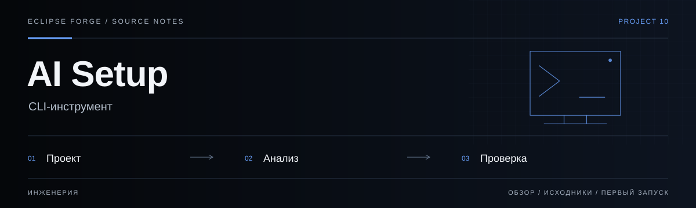

# AI Setup



**CLI-инструмент.** Анализ структуры проекта, оценка AI-документации и генерация конфигураций. Отдельный Codex-only режим CLI пока не реализован.

<!-- repository-guide:start -->
[Первый запуск](#readme-start) · [Что внутри](#readme-map) · [Путеводитель](docs/repository-guide.md#start) · [Карта кода](docs/repository-guide.md#map) · [Проверки](docs/repository-guide.md#checks) · [Границы и права](docs/repository-guide.md#boundaries)

<a id="readme-map"></a>

## Проект за минуту

- **[Анализ проекта](<src/analyzer.ts>)** — Определение стека и структуры исходников.
- **[Оценка конфигураций](<src/scorer.ts>)** — Детерминированная оценка существующей документации.
- **[Генераторы](<src/generator.ts>)** — Генерация разных AI-конфигураций; Codex-only режим CLI ещё не выделен.

<a id="readme-start"></a>

## Начать локально

**Среда:** Node.js и npm. **Источник:** [src/cli.ts](<src/cli.ts>).

Из корня клонированного репозитория:

```bash
npm ci
npm run dev -- --help
```

Открывается только справка. В CLI нет Codex-only флага: `init` создаёт четыре конфигурации, `refresh` перезаписывает их. В Eclipse эти команды не применяются к рабочим проектам.

<details>
<summary><strong>Перед первым запуском и изменением кода</strong></summary>

- Команды сверены с исходниками 8 сентября 2026. Это инструкция, а не отметка об успешном запуске или текущем production.
- Установка зависимостей может обращаться в registry и выполнять lifecycle scripts. Используйте отдельную рабочую среду и демонстрационные данные.
- init создаёт несколько AI-конфигураций, refresh перезаписывает их. В Eclipse используются справка и чтение оценки; генерация в рабочие проекты требует отдельного Codex-only режима и review.


</details>
<!-- repository-guide:end -->

## Что это?

AI-Setup сканирует ваш проект и автоматически генерирует конфиги для AI-инструментов:

| Файл | Для чего |
|------|----------|
| `CLAUDE.md` | Claude Code — стек, команды, структура, стиль кода |
| `.cursor/rules` | Cursor — правила и контекст проекта |
| `AGENTS.md` | Codex / Multi-agent — определения агентов |
| `.github/copilot-instructions.md` | GitHub Copilot — инструкции |

## Режим Eclipse: только Codex

> [!IMPORTANT]
> В опубликованном CLI нет Codex-only флага: `init` создаёт четыре AI-конфига, `refresh` перезаписывает их. В рабочих проектах Eclipse используйте только справку и чтение оценки; генерация требует отдельного фильтра и review. Отсутствие Claude-конфигурации намеренное, исправлять его ради баллов не нужно.

Для локальной справки: `npm ci`, затем `npm run dev -- --help`. Для оценки: `npm run dev -- score --path ../example-project`. Сетевой reverse-режим, npm test и typecheck в этой опубликованной версии отсутствуют.

## Возможности генерации (не запускать в рабочих проектах Eclipse)

```bash
# В корне вашего проекта:
npx @eclipse-forge/ai-setup init

# Оценить качество AI-конфигов:
npx @eclipse-forge/ai-setup score

# Обновить конфиги после изменений в коде:
npx @eclipse-forge/ai-setup refresh
```

## Как работает

```
ai-setup init
  │
  ├─ 1. Сканирует файлы проекта
  ├─ 2. Определяет стек (язык, фреймворк, пакетный менеджер)
  ├─ 3. Находит точки входа, зависимости, структуру
  ├─ 4. Генерирует 4 AI-конфига
  └─ 5. Скорит результат (0-100, грейд A-F)
```

## Скоринг

AI-Setup оценивает качество AI-конфигов **детерминистически** (без LLM):

```
⚡ AI-Setup Score

Грейд: A  Баллы: 94/100

  ██████████ CLAUDE.md                 25/25
  ██████████ .cursor/rules             20/20
  ██████████ AGENTS.md                 15/15
  ██████████ Copilot Instructions      10/10
  ██████████ README.md                 15/15
  ██████░░░░ Project Quality            9/15
```

**Категории:**
- **CLAUDE.md** (25 баллов) — наличие, секции, код, инструкции, объём
- **Cursor Rules** (20 баллов) — правила и детализация
- **AGENTS.md** (15 баллов) — определения агентов и команды
- **Copilot Instructions** (10 баллов) — наличие и объём
- **README.md** (15 баллов) — наличие, код, объём
- **Project Quality** (15 баллов) — .gitignore, LICENSE, .env.example, Docker, CI/CD

## Поддерживаемые стеки

| Язык | Фреймворки |
|------|-----------|
| TypeScript/JavaScript | React, Next.js, Vue, Svelte, Angular, Express, NestJS, Fastify |
| Python | FastAPI, Django, Flask |
| Rust | Tauri, Cargo проекты |
| C# | ASP.NET Core |
| Go, Java, Ruby, PHP | Базовая поддержка |

## Команды

| Команда | Описание |
|---------|----------|
| `ai-setup init` | Генерирует AI-конфиги + показывает скор |
| `ai-setup init --force` | Перезаписывает существующие файлы |
| `ai-setup score` | Показывает текущий скор конфигов |
| `ai-setup refresh` | Обновляет все конфиги |
| `ai-setup --help` | Справка |

## Установка (глобально)

```bash
npm install -g @eclipse-forge/ai-setup
```

## Лицензия

[MIT](LICENSE)

---

<div align="center">
<sub>Сделано в Eclipse Forge</sub>
</div>
